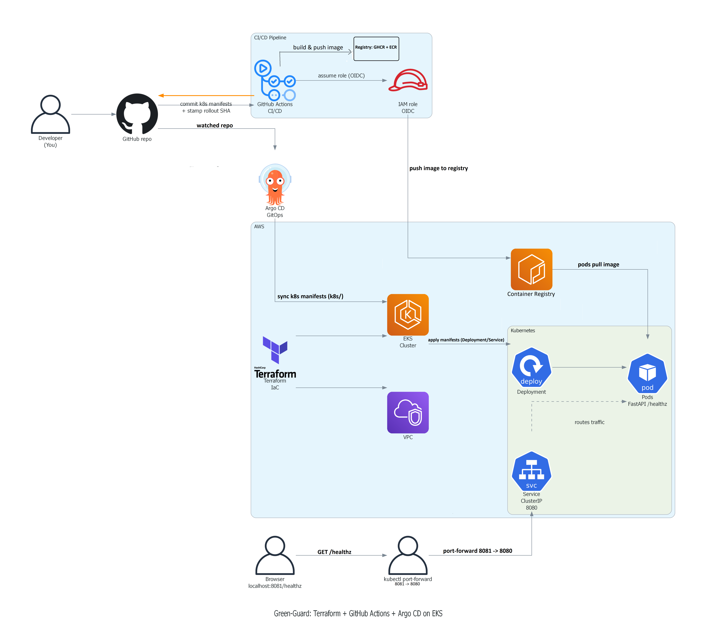

# 🛡️ green-guard

🧑‍💻 **Green-Guard** is a **DevOps [Development and Operations]** demo that provisions **EKS [Elastic Kubernetes Service]** with **Terraform [Infrastructure as Code]**, builds a container with **GitHub Actions [Continuous Integration and Continuous Delivery]**, pushes images to **ECR [Elastic Container Registry]** using **OIDC [OpenID Connect]**, and deploys via **Argo CD [GitOps Continuous Delivery]**.

## ✅ Status
* **Portfolio ready** ✅
* Evidence: **included below**
* Last updated: **2026-01-16**


## 🧠 What this demo shows
* **Terraform [Infrastructure as Code]** provisioning **VPC [Virtual Private Cloud]** + **EKS [Elastic Kubernetes Service]**
* **GitHub Actions [Continuous Integration and Continuous Delivery]** building Docker images
* **OIDC [OpenID Connect]** auth from GitHub to **AWS [Amazon Web Services]** (no long lived keys)
* Push to **ECR [Elastic Container Registry]**
* **Argo CD [GitOps Continuous Delivery]** syncing `k8s/` manifests to the cluster
* App verification via **FastAPI [Python Web Framework]** endpoint: `/healthz`

---

## 🧠 Architecture


* Diagram (click raw): https://raw.githubusercontent.com/just2courageous/green-guard/main/docs/diagrams/green-guard-arch.png

---

## 🎥 Demo video
* YouTube (video platform): **Planned (coming soon)**

---

## ✅ Endpoints
* `GET /`  
* `GET /healthz`

---

## 📦 Repo structure (source of truth)
* **[app/main.py](app/main.py)**: FastAPI [Python Web Framework] app
* **[Dockerfile](Dockerfile)**: container build
* **[requirements.txt](requirements.txt)**: Python dependencies
* **[k8s/deployment.yaml](k8s/deployment.yaml)**: Deployment [Kubernetes workload]
* **[k8s/service.yaml](k8s/service.yaml)**: Service [Kubernetes networking]
* **[k8s/argocd/app.yaml](k8s/argocd/app.yaml)**: Argo CD [GitOps Continuous Delivery] Application
* **[infra/eks/main.tf](infra/eks/main.tf)**: VPC [Virtual Private Cloud] + EKS [Elastic Kubernetes Service]
* **[.github/workflows/ci.yml](.github/workflows/ci.yml)**: GitHub Actions [Continuous Integration and Continuous Delivery] pipeline
* **[trust.json](trust.json)**: IAM [Identity and Access Management] role trust (OIDC [OpenID Connect])
* **[ecr-push-policy.json](ecr-push-policy.json)**: IAM [Identity and Access Management] permissions for ECR [Elastic Container Registry]
* **[docs/screenshots/](docs/screenshots/)**: proof screenshots

---

## 🚀 Run locally (quick sanity check)
### 1) Create venv (virtual environment) and install
```bash
python -m venv .venv
# Windows PowerShell:
. .\.venv\Scripts\Activate.ps1
pip install -r requirements.txt
```

## 🧾 Evidence table (claim → proof)
| Claim | Proof (click) |
| --- | --- |
| Local app `/healthz` works | [01-local-healthz.png](docs/screenshots/01-local-healthz.png) |
| GitHub Actions [Continuous Integration and Continuous Delivery] pipeline is green | [02-actions-green.png](docs/screenshots/02-actions-green.png) |
| GHCR [GitHub Container Registry] package exists | [03-ghcr-package.png](docs/screenshots/03-ghcr-package.png) |
| Kubernetes pods are ready | [04-k8s-pods-ready.png](docs/screenshots/04-k8s-pods-ready.png) |
| App rollout successful | [05-rollout-success.png](docs/screenshots/05-rollout-success.png) |
| Argo CD [GitOps Continuous Delivery] login | [06-argocd-login.png](docs/screenshots/06-argocd-login.png) |
| Argo CD [GitOps Continuous Delivery] app synced | [07-argocd-synced.png](docs/screenshots/07-argocd-synced.png) |
| Cluster `/healthz` reachable | [08-k8s-healthz.png](docs/screenshots/08-k8s-healthz.png) |
| Commit for v2 change | [09b-commit-v2.png](docs/screenshots/09b-commit-v2.png) |
| Actions build for v2 | [09-actions-build-for-v2.png](docs/screenshots/09-actions-build-for-v2.png) |
| Argo CD [GitOps Continuous Delivery] sync v2 | [10-argocd-sync-v2.png](docs/screenshots/10-argocd-sync-v2.png) |
| App UI v2 visible | [11-home-v2.png](docs/screenshots/11-home-v2.png) |
| ECR [Elastic Container Registry] repository exists | [12-ecr-repo.png](docs/screenshots/12-ecr-repo.png) |
| IAM [Identity and Access Management] role trust (OIDC [OpenID Connect]) | [13-iam-role-trust.png](docs/screenshots/13-iam-role-trust.png) |
| ECR [Elastic Container Registry] initially empty | [14-ecr-image-empty.png](docs/screenshots/14-ecr-image-empty.png) |
| Actions push to ECR [Elastic Container Registry] succeeded | [15-actions-ecr-green.png](docs/screenshots/15-actions-ecr-green.png) |
| ECR [Elastic Container Registry] image latest exists | [16-ecr-image-latest.png](docs/screenshots/16-ecr-image-latest.png) |
| EKS [Elastic Kubernetes Service] cluster active | [31-eks-cluster-active.png](docs/screenshots/31-eks-cluster-active.png) |
| EKS [Elastic Kubernetes Service] nodegroup status | [32-eks-nodegroup-status.png](docs/screenshots/32-eks-nodegroup-status.png) |
| NGINX (web server) port forward test | [33-nginx-portforward.png](docs/screenshots/33-nginx-portforward.png) |
| NGINX (web server) LoadBalancer test | [34-nginx-lb-AND-nginx-lb-browser.png](docs/screenshots/34-nginx-lb-AND-nginx-lb-browser.png) |
| App ready and browser proof | [35-ecr-app-ready-&-ecr-app-browser.png](docs/screenshots/35-ecr-app-ready-%26-ecr-app-browser.png) |
| Billing preferences set | [17-billing-preferences.png](docs/screenshots/17-billing-preferences.png) |
| SNS [Simple Notification Service] topic for billing alerts | [18-sns-topic-billing-alerts.png](docs/screenshots/18-sns-topic-billing-alerts.png) |
| SNS [Simple Notification Service] subscription pending | [19a-sns-subscription-pending.png](docs/screenshots/19a-sns-subscription-pending.png) |
| SNS [Simple Notification Service] subscription confirmed | [19b-sns-subscription-confirmed.png](docs/screenshots/19b-sns-subscription-confirmed.png) |
| CloudWatch [Amazon CloudWatch] billing alarm | [20-cloudwatch-billing-alarm.png](docs/screenshots/20-cloudwatch-billing-alarm.png) |
| CloudWatch [Amazon CloudWatch] billing metric view | [21 cloudwatch-billing-metrics-estimatedcharges-usd.png](docs/screenshots/21%20cloudwatch-billing-metrics-estimatedcharges-usd.png) |
| AWS Budgets [Cost Management] monthly budget | [22-budgets-monthly-cost.png](docs/screenshots/22-budgets-monthly-cost.png) |
| Zero spend budget created | [23a-zero-spend-created.png](docs/screenshots/23a-zero-spend-created.png) |
| Monthly budget alerts 80 and 100 | [23b-monthly-budget-80-100.png](docs/screenshots/23b-monthly-budget-80-100.png) |
| Cost anomaly monitor enabled | [24-anomaly-monitor.png](docs/screenshots/24-anomaly-monitor.png) |
| S3 [Simple Storage Service] tfstate versioning | [25a-s3-tfstate-versioning.png](docs/screenshots/25a-s3-tfstate-versioning.png) |
| S3 [Simple Storage Service] tfstate encryption | [25b-s3-tfstate-versioning-encryption.png](docs/screenshots/25b-s3-tfstate-versioning-encryption.png) |
| DynamoDB [NoSQL Database] lock table active | [26-dynamodb-lock-active.png](docs/screenshots/26-dynamodb-lock-active.png) |
| IAM [Identity and Access Management] GitHub Actions trust | [27-iam-gh-actions-ecr-trust.png](docs/screenshots/27-iam-gh-actions-ecr-trust.png) |
| IAM [Identity and Access Management] ECR permissions | [28-iamgh-actions-ecr-permissions.png](docs/screenshots/28-iamgh-actions-ecr-permissions.png) |
| Final CI run green | [29-actions-ci-green.png](docs/screenshots/29-actions-ci-green.png) |
| ECR [Elastic Container Registry] repo latest confirmed | [30-ecr-repo-latest.png](docs/screenshots/30-ecr-repo-latest.png) |

